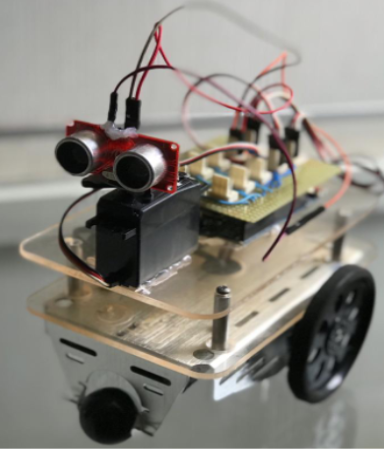

# Lógica Fuzzy - Sistemas Inteligentes

Material sobre Lógica Fuzzy e implementação utilizando a biblioteca EFLL para o Arduino. Informações sobre a biblioteca no link:
https://blog.zerokol.com/2012/09/arduinofuzzy-uma-biblioteca-fuzzy-para.html

Veja demonstração do controle de velocidade de deslocamento baseado na distância do obstáculo utilizando Lógica Fuzzy

❮img src="robo.png" ❯

https://www.youtube.com/watch?v=oRjFIVqer4o

