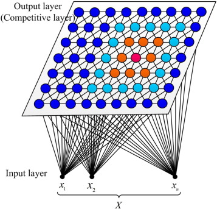

# Mapas AutoOrganizáveis - Sistemas Inteligentes

Rotinas da disciplina de Sistemas Inteligentes. Engenharia Elétrica. IFG Campus Goiânia.

Nesta pasta serão encontradas rotinas básicas para desenvolvimento de Redes Neurais Artificiais tipo Mapas AutoOrganizáveis.

A figura a seguir apresenta um modelo de RNA SOM.

Caso tenha dúvidas reporte pelo email carlos.junior@ifg.edu.br
